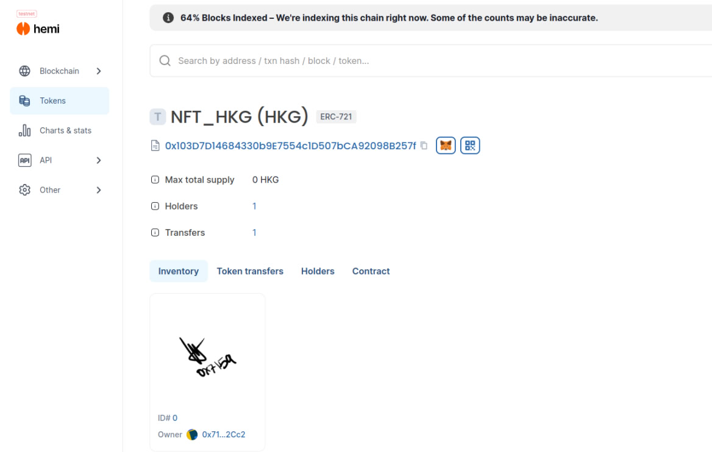

# Deploy ERC-721 on Hemi Network with Hardhat and IPFS

This guide walks through the process of deploying an ERC-721 token with images stored on IPFS using Hardhat on the Hemi network.

## Prerequisites

Ensure you have the following installed:
- [Node.js](https://nodejs.org/) (v12+)
- [NPM](https://www.npmjs.com/)
- [Hardhat](https://hardhat.org/)
- ETH Hemi Sepolia for gas fee.
- IPFS for hosting your images.

## Step 1: Setup Hardhat Project

1. **Create a new folder for your project** and initialize it:
    ```bash
    mkdir nft-erc721
    cd nft-erc721
    npm init -y
    mkdir contracts
    mkdir scripts
    ```

2. **Install Hardhat**:
    ```bash
    npm install --save-dev hardhat
    npx hardhat
    ```

3. When prompted, choose `Create a basic sample project` and confirm the installation of the necessary dependencies.

4. **Install OpenZeppelin contracts**:
    ```bash
    npm install @openzeppelin/contracts
    ```

5. **Install Ethers.js and dotenv** to manage private keys and RPC URLs:
    ```bash
    npm install @nomiclabs/hardhat-ethers ethers dotenv
    ```

## Step 2: Write the Smart Contract

1. **Create a `.env` file** to store your private key and RPC URL:
    ```env
    PRIVATE_KEY=your_private_key
    RPC_URL=https://testnet.rpc.hemi.network/rpc

    ```

2. **Create the ERC-721 Smart Contract**:

    Inside the `contracts/` folder, create a file `NFT.sol`:
    ```solidity
    // SPDX-License-Identifier: MIT
    pragma solidity ^0.8.0;

    import "@openzeppelin/contracts/token/ERC721/ERC721.sol";
    import "@openzeppelin/contracts/access/Ownable.sol";

    contract NFT_HKG is ERC721, Ownable {
        uint256 public tokenCounter;

        mapping(uint256 => string) private _tokenURIs;

        constructor() ERC721("NF_HKGT", "HKG") {
            tokenCounter = 0;
        }

        function mintNFT(address recipient, string memory tokenURI) public onlyOwner returns (uint256) {
            uint256 newTokenId = tokenCounter;
            _safeMint(recipient, newTokenId);
            _setTokenURI(newTokenId, tokenURI);
            tokenCounter += 1;
            return newTokenId;
        }

        function _setTokenURI(uint256 tokenId, string memory tokenURI) internal {
            _tokenURIs[tokenId] = tokenURI;
        }

        function tokenURI(uint256 tokenId) public view override returns (string memory) {
            return _tokenURIs[tokenId];
        }
    }
    ```

## Step 3: Configure Hardhat

1. **Open `hardhat.config.js`** and configure it for the Hemi network:
    ```javascript
    require("@nomiclabs/hardhat-ethers");
    require("dotenv").config();

    module.exports = {
      solidity: "0.8.18",
      networks: {
        hemi: {
          url: process.env.RPC_URL,
          accounts: [process.env.PRIVATE_KEY],
        },
      },
    };
    ```

## Step 4: Create Deployment Script

1. **Create a deployment script** in the `scripts/` folder called `deploy.js`:
    ```javascript
    async function main() {
      const [deployer] = await ethers.getSigners();
      console.log("Deploying contracts with the account:", deployer.address);

      const NFT = await ethers.getContractFactory("NFT_HKG");
      const nft = await NFT.deploy();

      console.log("NFT deployed to:", nft.address);
    }

    main()
      .then(() => process.exit(0))
      .catch((error) => {
        console.error(error);
        process.exit(1);
      });
    ```

2. **Deploy the contract**:
    ```bash
    npx hardhat run scripts/deploy.js --network hemi
    ```

The contract address will be logged in the terminal after successful deployment.

## Step 5: Mint NFT with IPFS Image

1. **Create a minting script** called `mint.js` in the `scripts/` folder:
    ```javascript
    async function main() {
      const nftAddress = "your_contract_address";  // Replace with your deployed contract address
      const [deployer] = await ethers.getSigners();

      const NFT = await ethers.getContractAt("NFT_HKG", nftAddress);

      const tokenURI = "ipfs://your-ipfs-hash";  // Replace with your IPFS image URL
      const tx = await NFT.mintNFT(deployer.address, tokenURI);
      await tx.wait();

      console.log(`NFT minted with tokenURI: ${tokenURI}`);
    }

    main()
      .then(() => process.exit(0))
      .catch((error) => {
        console.error(error);
        process.exit(1);
      });
    ```

2. **Run the minting script**:
    ```bash
    npx hardhat run scripts/mint.js --network hemi
    ```

Once the transaction is confirmed, the NFT will be minted with the provided IPFS URL.

## Conclusion

You have successfully deployed and minted an ERC-721 NFT with metadata stored on IPFS using Hardhat on the Hemi network. If you have any issues or questions, feel free to reach out!


## Result on HEMI TESNET



